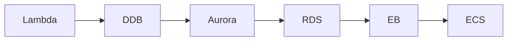

# InfraTales | AWS CDK Multi-Region Disaster Recovery: Aurora Global DB Failover Under 30 Minutes

**AWS CDK TYPESCRIPT reference architecture — platform pillar | advanced level**

> A financial services platform processing 10,000 operations per hour needs a cross-region DR setup with a 15-minute RPO and 30-minute RTO — requirements that sound reasonable until your on-call engineer is staring at a failed primary region at 2am with no tested runbook. Most teams bolt on DR as an afterthought and discover the gaps during an actual incident, not a drill. This project encodes the full DR topology in CDK TypeScript so the infrastructure itself is the runbook.

[](LICENSE)
[](CONTRIBUTING.md)
[](https://aws.amazon.com/)
[](https://aws.amazon.com/cdk/)
[](https://infratales.com/p/99c071e0-0081-446f-8b53-228baa1913fb/)
[](https://infratales.com)


## 📋 Table of Contents

- [Overview](#-overview)
- [Architecture](#-architecture)
- [Key Design Decisions](#-key-design-decisions)
- [Getting Started](#-getting-started)
- [Deployment](#-deployment)
- [Docs](#-docs)
- [Full Guide](#-full-guide-on-infratales)
- [License](#-license)

---

## 🎯 Overview

The stack spans us-east-2 (primary) and us-east-1 (DR) using Aurora Global Database for sub-second cross-region replication, DynamoDB Global Tables for session state, and ECS Fargate behind Application Load Balancers in each region. Route 53 health checks drive automated DNS failover, while a Lambda-based failover orchestrator — triggered by EventBridge alarms — handles the RDS cluster promotion sequence and ALB target group updates. All data at rest and in transit is encrypted via KMS customer-managed keys, with secrets stored in Secrets Manager per region. The non-obvious design choice is using an inline Lambda health checker that polls both RDS cluster status and ALB target health before EventBridge fires the failover sequence, adding a validation gate that prevents split-brain during a partial outage.

**Pillar:** PLATFORM — part of the [InfraTales AWS Reference Architecture series](https://infratales.com).
**Target audience:** advanced cloud and DevOps engineers building production AWS infrastructure.

---

## 🏗️ Architecture



> 📐 See [`diagrams/`](diagrams/) for full architecture, sequence, and data flow diagrams.

> Architecture diagrams in [`diagrams/`](diagrams/) show the full service topology (architecture, sequence, and data flow).
> The [`docs/architecture.md`](docs/architecture.md) file covers component responsibilities and data flow.

---

## 🔑 Key Design Decisions

- Aurora Global Database cross-region replication adds roughly $300-500/month in replication I/O costs on top of the secondary cluster charges — but it compresses RPO from hours (snapshot restore) to under 1 minute of lag [inferred from Aurora Global DB docs]
- DynamoDB Global Tables for session replication doubles write costs since every write is replicated to the DR region — acceptable for session data at this volume but worth isolating to session-only tables rather than general application state [editorial]
- ECS Fargate in the DR region kept at minimal task count (warm standby) adds fixed monthly cost even when idle — the alternative of scaling from zero on failover would blow the 30-minute RTO [inferred]
- The inline Lambda health check code baked into CDK using Code.fromInline() is convenient but untestable in isolation — any logic bug ships silently and only surfaces during an actual failover [from-code]
- KMS customer-managed keys per region require explicit cross-region key grants for Aurora snapshot copying, which is a setup step teams frequently miss until the first DR drill [editorial]

> For the full reasoning behind each decision — cost models, alternatives considered, and what breaks at scale — see the **[Full Guide on InfraTales](https://infratales.com/p/99c071e0-0081-446f-8b53-228baa1913fb/)**.

---

## 🚀 Getting Started

### Prerequisites

```bash
node >= 18
npm >= 9
aws-cdk >= 2.x
AWS CLI configured with appropriate permissions
```

### Install

```bash
git clone https://github.com/InfraTales/<repo-name>.git
cd <repo-name>
npm install
```

### Bootstrap (first time per account/region)

```bash
cdk bootstrap aws://YOUR_ACCOUNT_ID/YOUR_REGION
```

---

## 📦 Deployment

```bash
# Review what will be created
cdk diff --context env=dev

# Deploy to dev
cdk deploy --context env=dev

# Deploy to production (requires broadening approval)
cdk deploy --context env=prod --require-approval broadening
```

> ⚠️ Always run `cdk diff` before deploying to production. Review all IAM and security group changes.

---

## 📂 Docs

| Document | Description |
|---|---|
| [Architecture](docs/architecture.md) | System design, component responsibilities, data flow |
| [Runbook](docs/runbook.md) | Operational runbook for on-call engineers |
| [Cost Model](docs/cost.md) | Cost breakdown by component and environment (₹) |
| [Security](docs/security.md) | Security controls, IAM boundaries, compliance notes |
| [Troubleshooting](docs/troubleshooting.md) | Common issues and fixes |

---

## 📖 Full Guide on InfraTales

This repo contains **sanitized reference code**. The full production guide covers:

- Complete AWS CDK TYPESCRIPT stack walkthrough with annotated code
- Step-by-step deployment sequence with validation checkpoints
- Edge cases and failure modes — what breaks in production and why
- Cost breakdown by component and environment
- Alternatives considered and the exact reasons they were ruled out
- Post-deploy validation checklist

**→ [Read the Full Production Guide on InfraTales](https://infratales.com/p/99c071e0-0081-446f-8b53-228baa1913fb/)**

---

## 🤝 Contributing

See [CONTRIBUTING.md](CONTRIBUTING.md) for guidelines. Issues and PRs welcome.

## 🔒 Security

See [SECURITY.md](SECURITY.md) for our security policy and how to report vulnerabilities responsibly.

## 📄 License

See [LICENSE](LICENSE) for terms. Source code is provided for reference and learning.

---

<p align="center">
  Built by <a href="https://infratales.com">InfraTales</a> — Production AWS Architecture for Engineers Who Build Real Systems
</p>
